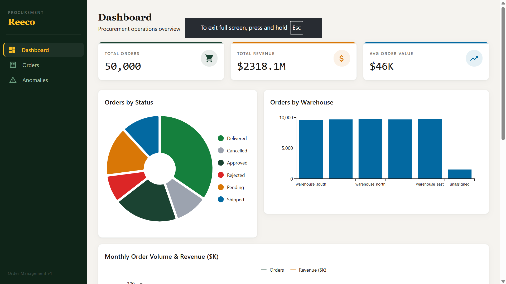
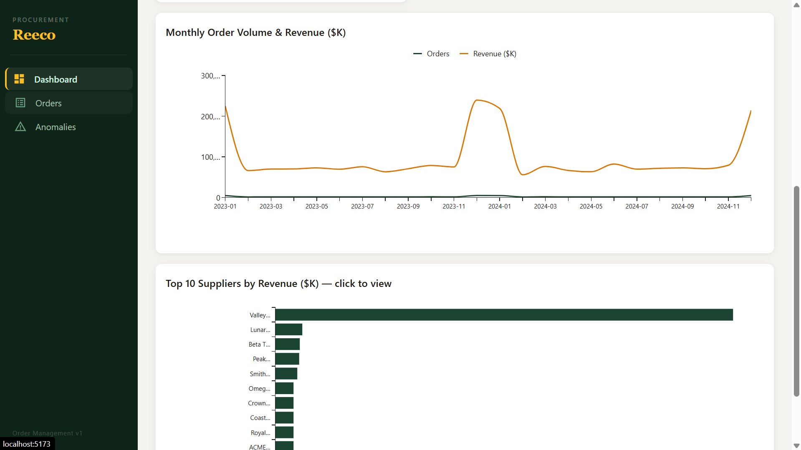
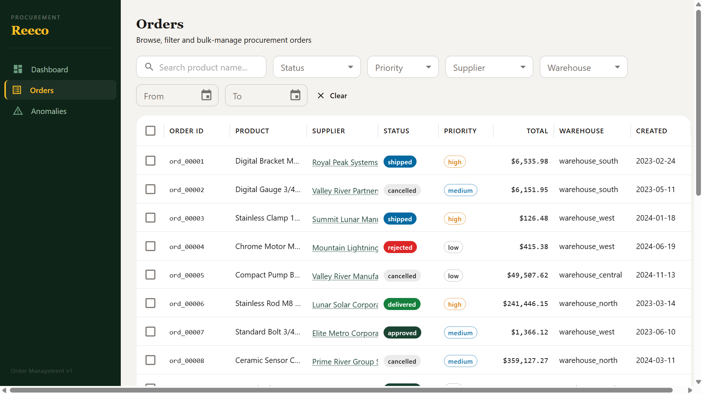
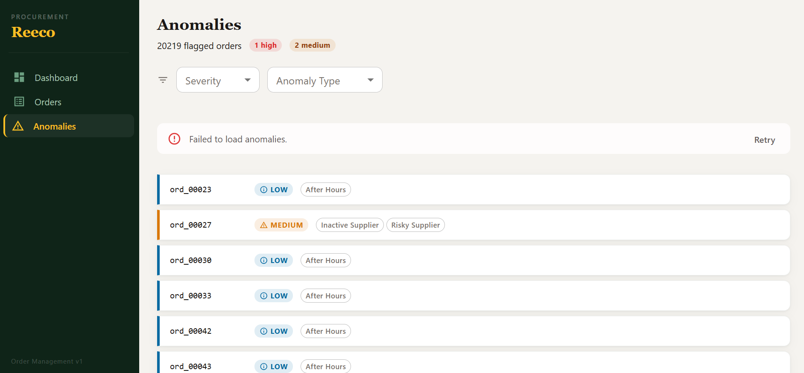

# Reeco — Procurement Order Management Dashboard

A full-stack procurement order management system built as a senior take-home engineering assignment. Features a REST API backend (C# .NET 9), a React + TypeScript frontend, PostgreSQL for storage, and Redis for caching and real-time events.

---

## Tech Stack

| Layer | Technology |
|-------|-----------|
| Backend | C# .NET 9 / ASP.NET Core |
| Frontend | React 18 + TypeScript + Vite + MUI |
| Database | PostgreSQL 16 |
| Cache | Redis 7 |
| ORM | EF Core 9 + Npgsql |
| Schema migrations | DbUp |

---

## Prerequisites

- [Docker Desktop](https://www.docker.com/products/docker-desktop/) — runs PostgreSQL, Redis, migrations, and the API
- [.NET 9 SDK](https://dotnet.microsoft.com/download) — for local backend development (optional if using Docker)
- [Node.js 18+](https://nodejs.org/) — for the frontend and test suite

---

## Quick Start

```bash
# 1. Start all infrastructure + API (PostgreSQL, Redis, migrations, backend)
docker-compose up -d

# 2. Start the frontend dev server
cd src/frontend
npm install
npm run dev
# → http://localhost:5173

# 3. Run the automated test suite
cd tests
npm install
npm test
```

The first `docker-compose up` will:
1. Start PostgreSQL and Redis
2. Run database migrations (DbUp)
3. Seed all CSV data into PostgreSQL (50k orders, 500 suppliers, 5k products, 195 categories)
4. Start the API on port 3000

Subsequent starts skip seeding if data is already present.

---

## Project Structure

```
Reeco/
├── data/                  # CSV seed data (read-only)
├── src/
│   ├── backend/           # C# .NET 9 REST API
│   │   ├── Controllers/   # HTTP route handlers
│   │   ├── Services/      # Business logic
│   │   ├── Models/        # Entities, DTOs, Enums, Constants
│   │   ├── Data/          # EF Core DbContext
│   │   └── Migrator/      # Standalone migration + seeding runner
│   ├── migrations/        # SQL migration scripts
│   └── frontend/          # React + TypeScript SPA
│       └── src/
│           ├── pages/     # Route views
│           ├── components/# Shared UI components
│           ├── hooks/     # React Query data hooks
│           └── services/  # Axios API client
├── tests/                 # Automated test suite (read-only)
├── docker-compose.yml
├── ARCHITECTURE.md        # Technical design doc
└── ANOMALY_STRATEGY.md    # Anomaly detection design doc
```

---

## API Reference

All endpoints are under `http://localhost:3000/api`.

**Pagination shape** (all list endpoints):
```json
{ "data": [...], "total": 50000, "limit": 20, "offset": 0 }
```

**Error shape** (all errors):
```json
{ "error": "Human-readable message", "code": "ERROR_CODE" }
```

### Orders

| Method | Path | Description |
|--------|------|-------------|
| GET | `/api/orders` | Paginated list with filters |
| GET | `/api/orders/:id` | Single order (includes `supplier_name`, `product_name`) |
| PATCH | `/api/orders/:id` | Update `status` / `priority` |
| GET | `/api/orders/stats` | Dashboard aggregations (cached) |
| GET | `/api/orders/anomalies` | Flagged anomalous orders |
| POST | `/api/orders/bulk-action` | Async bulk approve/reject/flag → 202 with `jobId` |

**Order filters** (`GET /api/orders` query params):

| Param | Example | Behavior |
|-------|---------|----------|
| `status` | `pending` or `pending,approved` | Single or comma-separated |
| `priority` | `critical` | |
| `supplier_id` | `sup_042` | |
| `warehouse` | `warehouse_east` | |
| `date_from` / `date_to` | `2024-06-01` | Inclusive date range on `created_at` |
| `min_total` | `1000` | `total_price >= value` |
| `search` | `hydraulic` | Case-insensitive search on `product_name` |
| `sort` / `order` | `total_price` / `desc` | Sort field and direction |
| `limit` / `offset` | `50` / `100` | Pagination |

**Valid statuses:** `pending` `approved` `rejected` `shipped` `delivered` `cancelled`

### Suppliers

| Method | Path | Description |
|--------|------|-------------|
| GET | `/api/suppliers` | Paginated list |
| GET | `/api/suppliers/:id` | Detail with `order_count` and `total_revenue` |
| GET | `/api/suppliers/:id/performance` | Delivery days, rejection rate, monthly trend, price consistency |

### Products

| Method | Path | Description |
|--------|------|-------------|
| GET | `/api/products` | Paginated list |
| GET | `/api/products?category=cat_001` | Filter by category (recursive — includes all descendants) |

### Jobs

| Method | Path | Description |
|--------|------|-------------|
| GET | `/api/jobs/:id` | Poll async bulk job status + progress |

### Events

| Method | Path | Description |
|--------|------|-------------|
| GET | `/api/events` | SSE stream. Optional `?supplier_id=` for filtered events |

---

## Running the Test Suite

```bash
cd tests
npm install

npm test                   # All 83 tests
npm run test:basic         # Basic CRUD (15 pts)
npm run test:filter        # Filtering & sorting (10 pts)
npm run test:agg           # Aggregations (20 pts)
npm run test:anomaly       # Anomaly detection (15 pts)
npm run test:bulk          # Bulk operations (15 pts)
npm run test:concurrent    # Concurrency (15 pts)
npm run test:perf          # Performance benchmarks (10 pts)
npm run test:realtime      # WebSocket / SSE (10 pts)
npm run test:security      # Input validation (5 pts)

npm run grade              # Full run with JSON score output
```

Override the API URL if not on port 3000:
```bash
API_URL=http://localhost:8080 npm test
```

---

## CI

A GitHub Actions workflow (`.github/workflows/ci.yml`) runs on every push to `main` and on manual dispatch. It:

1. Builds and starts the full Docker stack (`docker compose up -d --build`) — PostgreSQL, Redis, migrations, and the API
2. Polls `GET /api/orders` until the API is ready (up to 150 seconds)
3. Runs the complete 83-test suite (`npm test` in `tests/`)

All tests run against real seeded data, the same way they would locally.

---

## Frontend





---

## Further Reading

- [ARCHITECTURE.md](./ARCHITECTURE.md) — DB schema, indexing strategy, concurrency, caching, real-time events, and tradeoffs
- [ANOMALY_STRATEGY.md](./ANOMALY_STRATEGY.md) — Anomaly detection rules, severity logic, data patterns, and improvement ideas
